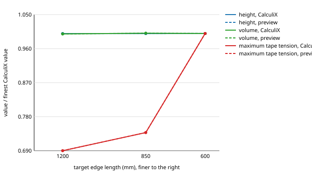

# Preview vs CalculiX verification

_Auto-generated by `python scripts/generate_validation_docs.py calculix` from `calculix_adapter.validation` (data: `preview-vs-calculix.json`). Do not edit by hand; `tests/calculix/test_validation.py` fails if this page is stale._

CalculiX CrunchiX 2.21, one thread. Relative errors are
fractions (0.01 = 1 %). A result that did not meet every convergence criterion
of the adapter is shown as *not converged* and fails.

## Benchmarks

| Benchmark | Computed | Reference | Unit | Error | Tolerance | Status |
|---|---|---|---|---|---|---|
| CalculiX sphere R0=2 m, p=1 kPa, octant 24 div: mean N1 vs p r/2 | 1007 | 1007 | N/m | 0.0002 | 0.02 | pass |
| CalculiX sphere R0=2 m, p=1 kPa, octant 24 div: mean N2 vs p r/2 | 1004 | 1007 | N/m | 0.003 | 0.02 | pass |
| CalculiX sphere R0=2 m, p=1 kPa, octant 24 div: converged (0 = yes) | - | - | - | 0 | 0 | pass |
| CalculiX sphere R0=2 m, p=1 kPa, octant 24 div: relative out-of-balance | - | - | - | < 1e-05 | 1e-05 | pass |
| CalculiX cylinder R0=1 m, p=1 kPa, 48x16: mean hoop N vs p r | 1006 | 1008 | N/m | 0.002 | 0.02 | pass |
| CalculiX cylinder R0=1 m, p=1 kPa, 48x16: mean axial N vs p r/2 | 503.2 | 504.2 | N/m | 0.002 | 0.02 | pass |
| CalculiX cylinder R0=1 m, p=1 kPa, 48x16: converged (0 = yes) | - | - | - | 0 | 0 | pass |
| CalculiX cylinder R0=1 m, p=1 kPa, 48x16: relative out-of-balance | - | - | - | < 1e-05 | 1e-05 | pass |
| Envelope, 600 mm mesh: CalculiX vs preview, height | 14.25 | 14.25 | m | < 1e-05 | 0.05 | pass |
| Envelope, 600 mm mesh: CalculiX vs preview, volume | 1348 | 1348 | m^3 | < 1e-05 | 0.05 | pass |
| Envelope, 600 mm mesh: CalculiX vs preview, maximum tape tension | 147.3 | 147.3 | N | < 1e-05 | 0.05 | pass |
| Envelope: levels not converged (preview or CalculiX) | - | - | - | 0 | 0 | pass |
| Envelope, CalculiX, last two levels: height | 14.25 | 14.24 | m | 0.0003 | 0.02 | pass |
| Envelope, CalculiX, last two levels: volume | 1348 | 1349 | m^3 | 0.0008 | 0.02 | pass |

In the envelope rows *Computed* is the preview value and *Reference* the CalculiX
value.

!!! note "What the envelope comparison verifies"
    CalculiX is started from the preview's equilibrium and must meet its own
    convergence criteria with its own elements, material law and equation solver.
    Agreement therefore shows that the preview's shape, stresses and tape tensions
    are an equilibrium of an independent finite-element model of the same design;
    it is not an independent form finding (see *Known differences*: started away
    from equilibrium, CalculiX's tension-field passes do not converge).

## Full comparison, 600 mm mesh

Generic spherical envelope fixture (`tests/fixtures/spherical_envelope`), 100 degC
internal, ISA sea level, fabric and tape weight, mouth fixed, crown closed by an
unmeshed parachute, seam meridians in x = 0 and y = 0 kept on those planes,
tension field on (residual stiffness 1e-3). Rows above 5 % are flagged; see the
known differences below.

| Quantity | Preview | CalculiX | Unit | Difference | Status |
|---|---|---|---|---|---|
| height | 14.25 | 14.25 | m | 0.0 % | within 5 % |
| maximum width | 14.06 | 14.06 | m | 0.0 % | within 5 % |
| volume | 1348 | 1348 | m^3 | 0.0 % | within 5 % |
| maximum displacement | 0.9556 | 0.9556 | m | 0.0 % | within 5 % |
| nodal displacement difference (RMS / max displacement) | 0 | < 1e-06 | - | 0.0 % | within 5 % |
| mean N1 (area-weighted) | 132 | 132 | N/m | 0.0 % | within 5 % |
| N1, 99th percentile | 467.1 | 467.1 | N/m | 0.0 % | within 5 % |
| maximum tape tension | 147.3 | 147.3 | N | 0.0 % | within 5 % |
| mean tape tension | 38.17 | 38.17 | N | 0.0 % | within 5 % |

## Mesh convergence (CalculiX)

| Target edge (mm) | Nodes | Triangles | Converged | Passes | Largest CalculiX movement from the preview (mm) | Height (m) | Max width (m) | Volume (m^3) | Max tape tension (N) | Tape peak: distance from nearest fixed node (m) |
|---|---|---|---|---|---|---|---|---|---|---|
| 1200 | 1164 | 2292 | yes | 1 | < 0.01 | 14.25 | 14.05 | 1346 | 101.7 | 14 |
| 850 | 1908 | 3768 | yes | 1 | < 0.01 | 14.24 | 14.06 | 1349 | 108.8 | 14 |
| 600 | 3036 | 6012 | yes | 1 | < 0.01 | 14.25 | 14.06 | 1348 | 147.3 | 0.15 |

Richardson extrapolation (mean refinement ratio 1.41):

| Quantity | Observed order | Extrapolated | Finest level | Estimated error |
|---|---|---|---|---|
| height | not in the asymptotic range (spread 0.027 %) | - | 14.25 | - |
| volume | not in the asymptotic range (spread 0.19 %) | - | 1348 | - |
| maximum tape tension | not in the asymptotic range (spread 31 %) | - | 147.3 | - |

!!! warning "Maximum tape tension is not mesh-converged"
    It changes by 35 % between the last two levels; the two
    solvers agree on each level, but the value itself depends on the mesh (see
    *Known differences and limitations*).

## Known differences and limitations

* **Starting geometry: CalculiX checks the preview's equilibrium, it does not find it.**
  Started from the design (initial) shape of the envelope, the as-sewn misfit produces
  out-of-balance forces about 90 times the pressure load and CalculiX's release steps fail
  even with 32 continuation steps and increased stabilisation. Started 0.2 to 0.3 m away
  from equilibrium (the preview shape computed with the tension field switched the other
  way), the passes stall at
  an out-of-balance of about 10 % of the load after 60 passes: with the tension field about
  1 % of the elements change state every pass, and without it the compressed fabric has no
  stiffness against buckling. The sphere and cylinder benchmarks do start from their
  initial shape.
* **Maximum tape tension is not mesh-converged** (either solver; both agree on every
  level): 101.7, 108.8, 147.3 N at 1200, 850, 600 mm, with the peak 14, 14, 0.15 m from the nearest fixed node.
  Where the peak sits on the tapes next to the fixed mouth nodes it grows with refinement,
  like a stress at an idealised point support; on the crown ring it changes by a few per
  cent between levels. Do not read a tape factor of safety at the mouth from one mesh:
  refine, or model the mouth attachment in detail. Tape tension in wrinkled regions also
  depends on the residual stiffness of wrinkled fabric (about a factor of two between 1e-3
  and 1e-2 in the preview; both solvers use 1e-3 here).
* **Displacements in wrinkled fabric** are only weakly determined (near-mechanisms) and are
  not mesh-converged (see the preview solver benchmarks).
* **Same discretisation class.** CalculiX M3D3 elements are constant-strain triangles like
  the preview's, on the same mesh with the same material law (the iterative membrane
  properties reproduce the preview's tension-field law exactly at convergence) and the
  same consistent nodal pressure loads. The comparison therefore checks the equilibrium
  and its evaluation (element forces, tape law, loads, reactions), not discretisation
  error; the mesh-convergence table addresses that.
* **Element choice.** S3 thin shells give the right sphere and cylinder, but on the sewn
  envelope they carried load through transverse shear at the seam creases and were
  rejected.
* **Pressure** enters as consistent nodal loads per pass (CalculiX 2.21 crashes with
  element pressure on M3D3); follower effects are captured by the passes.
